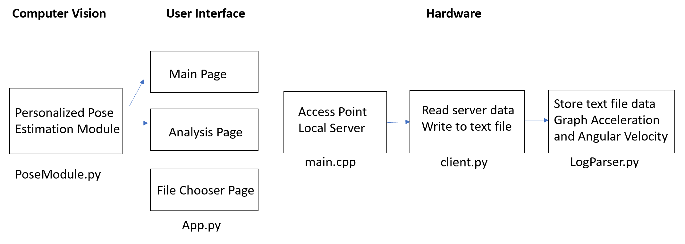
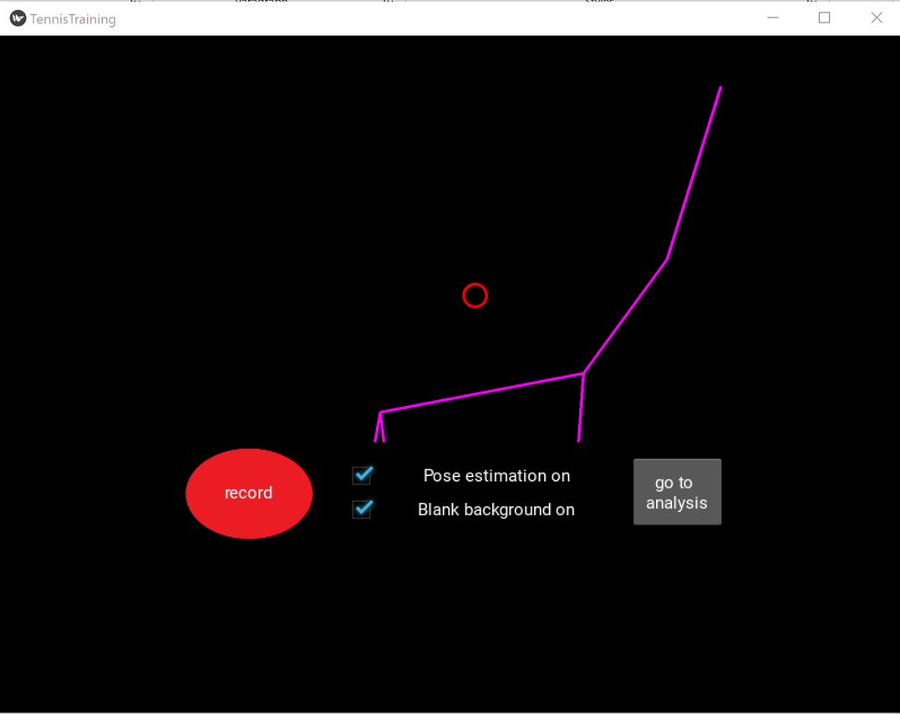
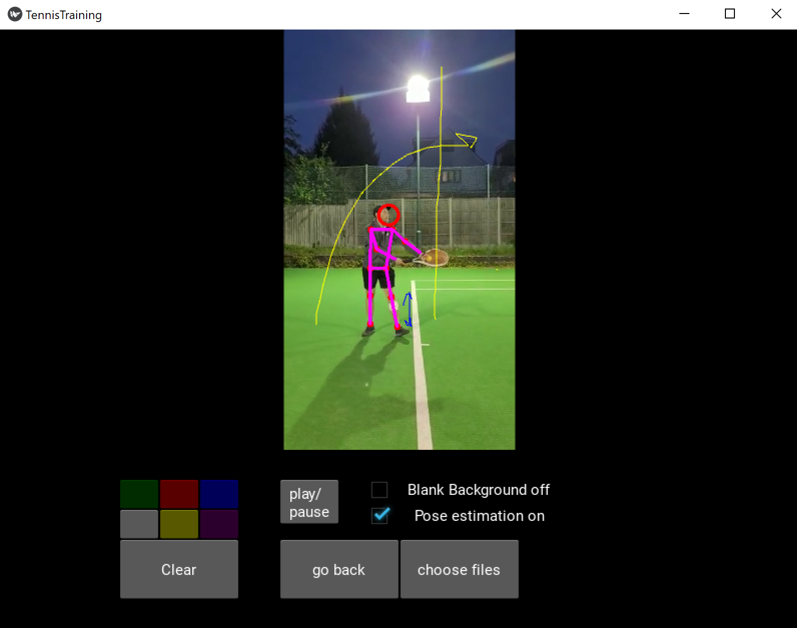

# Tennis Training System

The main idea of this project is to explore how technology can be used to improve sports and specifically how computer vision and sensors can be used to improve a tennis player’s performance. The two aspects of the players game which are to be tackled with this analysis are technique and game plan. Technique will be corrected and adjusted utilizing an open source pose estimation algorithm, then the players' pose can be corrected using the drawing tools that exist in the application. This project also aims to read and analyse data coming via WIFI from an Arduino Nano RP2040 which has a built-in IMU sensor mounted on the racket.

The system communicates as below:

## PoseModule.py
In this file, I am adding the feature of drawing a personalized stick figure (drawing only the joints necessary) with a blank background. The method which I created in this module is called drawCustomizedFigure. The original module is from cvzone (https://www.computervision.zone/).

## App.py
### RUN THIS FILE FOR LAUNCHING THE APP
In this file I created a user interface using Python Kivy use the pose estimation algorithm to help a tennis player improve its game. 

### MAIN PAGE

### ANALYSIS PAGE

## micro/Tennis Racket Sensor/src/main.cpp
This is the arduino code which creates an access point and prints IMU data to a local server so it can be fetched later.

## client.py
This script reads IMU data from a local server and writes to a text file based on user input in order to process the data later.

## LogParser.py
This script parses the IMU data which was stored in a text file and creates graphs based on the data for analysis.

## Final Project Report
Read the report for more information and results from the collection of data with the IMU sensor.

